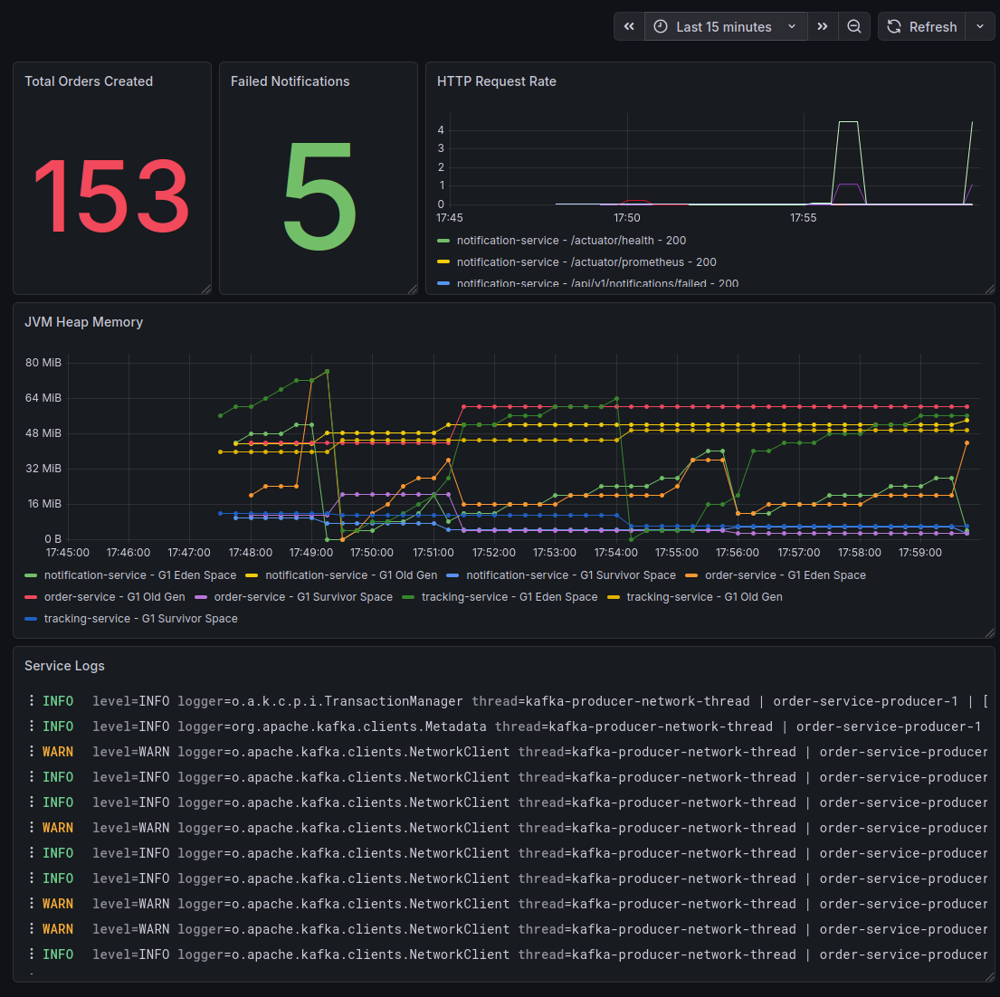

# Observability

TrackFlow includes a full observability stack using the LGTM stack:

- Prometheus (metrics)
- Loki (logs)
- Tempo (distributed tracing)
- Grafana (visualization)

The services expose metrics through Spring Boot Actuator and Micrometer.

## Dashboard

Below is the main Grafana dashboard used to monitor the system.

The dashboard includes:

• Total Orders Created  
• Failed Notifications  
• HTTP Request Rate  
• JVM Heap Memory  
• Service Logs

## Dashboard JSON

The dashboard configuration is stored as code and can be imported directly into Grafana.

Location: 
